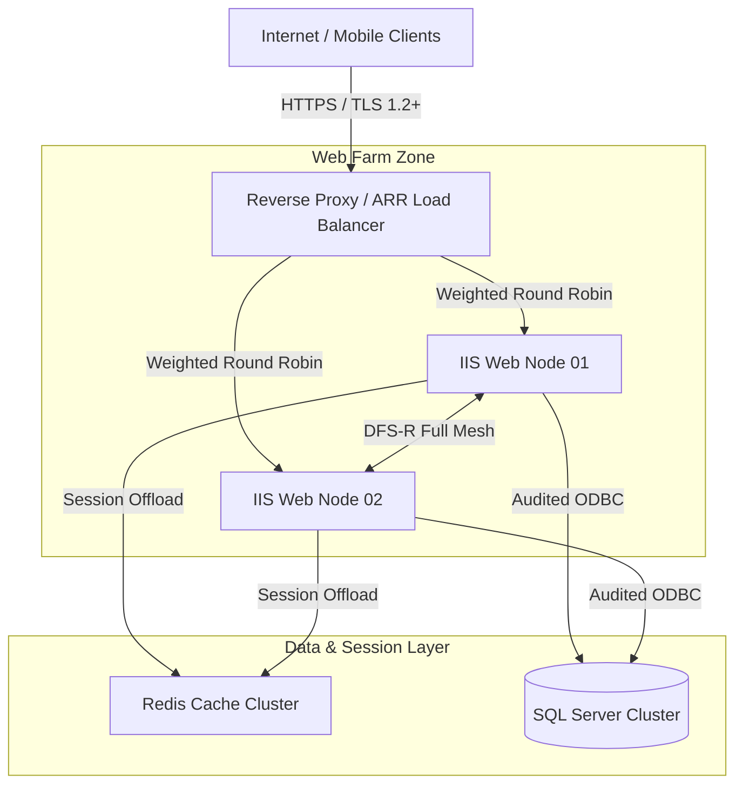

# Edge Security & High Availability Architecture for Critical Applications

## Executive Summary
Design and implementation of a high-availability, secure edge architecture for a mission-critical educational application (App Movvy). The solution was engineered to withstand massive concurrent traffic spikes during school hours while ensuring zero downtime, continuous file replication, and complete perimeter protection for sensitive student data.

> **Public Recognition:** The platform's resilience and positive impact on community safety were highlighted in regional media outlets.

---

## Technical Architecture

## Key Engineering Decisions & Hardening

* **Perimeter Security & Load Balancing:** Configured IIS Application Request Routing (ARR 3.0) with Weighted Round Robin distribution. Set `Response Buffer Threshold` to 1024 KB and adjusted connection timeouts to mitigate buffer overflow attacks and slowloris DoS vectors.
* **Web Farm Isolation:** Deployed IIS Shared Configuration across redundant nodes under the Least Privilege principle, using restricted service account credentials.
* **Continuous File Synchronization:** Configured continuous DFS-R (Distributed File System Replication) in Full Mesh topology with full bandwidth allocation to ensure zero-lag file sync across nodes.
* **Session & Cache Isolation:** Implemented dedicated Redis instances for in-memory session handling, preventing session hijacking and reducing DB queries.
* **Database Hardening & Maintenance:** Enforced audited ODBC connectors (SQL Server Native Client 11.0) and automated temporary file purge via Task Scheduler to eliminate data leakage risks.

---

## Repository Contents (Sanitized)
* `docs/`: Architecture diagrams and network flow documentation.
* `src/ARR-Rewrite-Rules.xml`: Sanitized URL Rewrite and Reverse Proxy configuration templates.
* `src/redis-hardening-template.conf`: Security parameters for Redis cache isolation.
* `src/Clean-AppTempFiles.ps1`: Automated maintenance script for log/temp file sanitization.

---

*Disclaimer: All IP addresses, server names, credentials, and domain identifiers in this repository have been fully sanitized and anonymized.*
