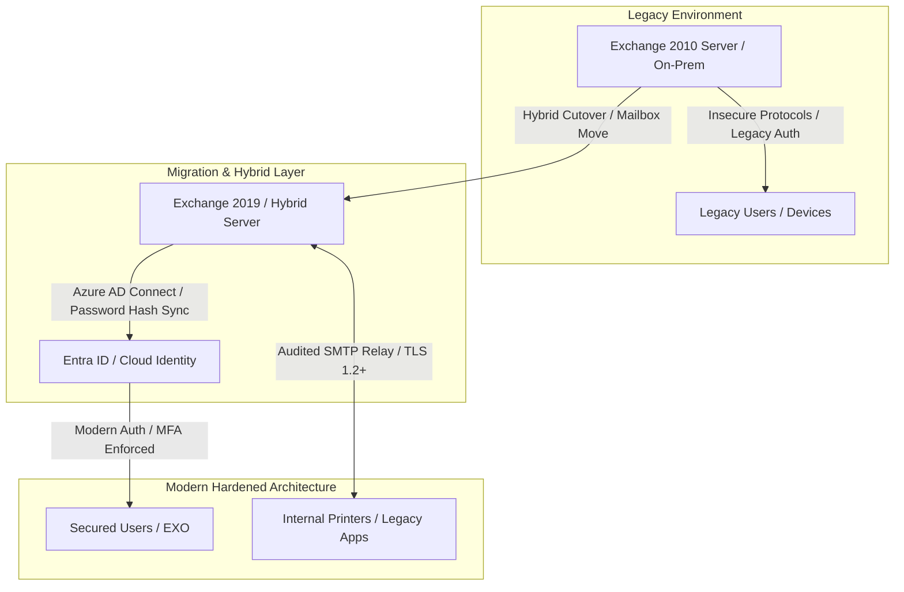

# Legacy Exchange Migration & Active Directory Infrastructure Hardening

## Executive Summary
Design and execution of a hybrid messaging infrastructure migration and Active Directory Domain Services (AD DS) security hardening. The initiative eliminated legacy Exchange vulnerabilities, modernized identity protocols, enforced strict MFA policies, and isolated legacy service accounts.

---

## Migration & Security Flow

---

## Key Engineering Decisions & Hardening

* **Decommissioning Legacy Exchange:** Phased migration from Exchange 2010 to Exchange 2019 Hybrid topology, followed by complete RFC-compliant mail flow cutover to Exchange Online and legacy server demotion.
* **Active Directory Schema & Domain Prep:** Prepared AD schema for Exchange 2019 integration, auditing and clearing obsolete schema attributes and metadata left by decommissioned domain controllers.
* **Authentication Modernization:** Disabled NTLMv1 and SMBv1 across all Domain Controllers and member servers via Group Policy (GPO), enforcing NTLMv2, Kerberos, and TLS 1.2+ mandatory ciphers.
* **Identity Protection & MFA Enforcement:** Implemented Azure AD Connect with Password Hash Sync (PHS) and hybrid Conditional Access policies, mandating Multi-Factor Authentication (MFA) for all external access.
* **Service Account & Relay Isolation:** Isolated legacy application SMTP traffic to a dedicated Exchange 2019 Receive Connector restricted by explicit source IP whitelisting and mandatory TLS.

---

## Repository Contents (Sanitized)
* `docs/`: Migration architecture diagrams and cutover checklists.
* `src/Disable-LegacyAuthGPO.ps1`: Automation script for auditing and disabling NTLMv1/SMBv1 via PowerShell/GPO.
* `src/Audit-ExchangeMailboxes.ps1`: Health-check script for pre-migration mailbox sizes and protocol status.
* `src/Exchange2019-Relay-Config.ps1`: Automated creation of restricted internal SMTP relay connectors.

---

*Disclaimer: All IP addresses, server names, credentials, and domain identifiers in this repository have been fully sanitized and anonymized.*
