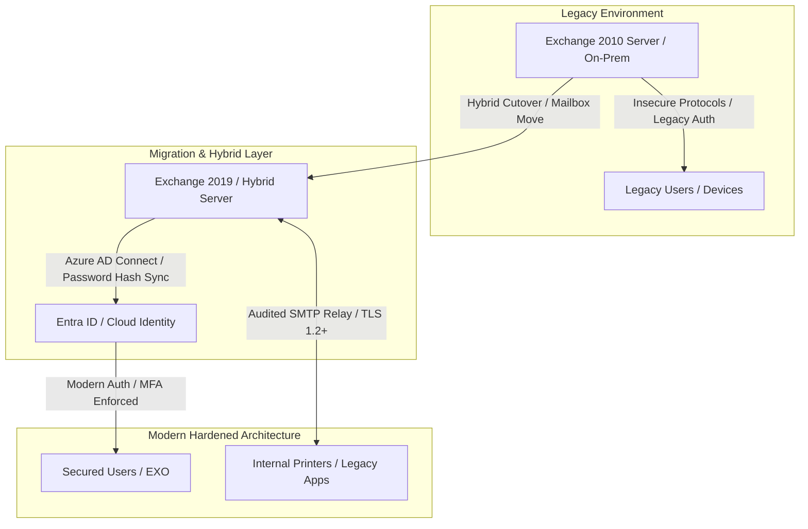

# Legacy Exchange Migration & Active Directory Infrastructure Hardening

## Executive Summary
Design and execution of a hybrid messaging infrastructure migration and Active Directory Domain Services (AD DS) security hardening. The initiative eliminated legacy Exchange vulnerabilities, modernized identity protocols, enforced strict MFA policies, and isolated legacy service accounts.

---

## Migration & Security Flow

