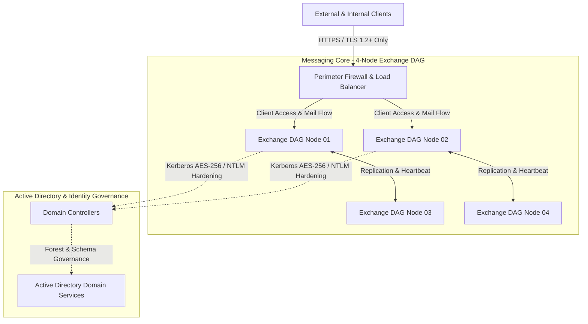

# Vulnerability Assessment, Protocol Hardening & Infrastructure Governance (Exchange DAG & Active Directory)

## Executive Summary
Design and execution of a comprehensive vulnerability assessment, protocol hardening, and security posture upgrade for an enterprise messaging infrastructure supported by a 4-node virtualized Microsoft Exchange Server Database Availability Group (DAG). The initiative identified and mitigated critical authentication exposure risks (clear-text legacy protocols), mapped remote code execution (RCE) and local elevation of privilege (LoPE) vulnerabilities, performed identity layer security analysis on Active Directory, and established capacity/connectivity governance to ensure continuous business operations and high availability.

---

## Technical Architecture & Assessment Domain

## Server Specifications & Domain Scope

* **Exchange DAG Nodes (01 to 04):** 4 virtualized Microsoft Exchange Server instances configured in a Database Availability Group (DAG), hosting mailbox databases with multi-site database copy replication.
* **Active Directory Domain Controllers:** Windows Server Domain Controllers supporting directory services, Kerberos authentication, and Schema level governance for the messaging environment.
* **Edge & Relay Points:** Perimeter connectors handling external mail flow, Autodiscover services, and client proxy authentication.

---

## Key Assessment Findings & Engineering Remediation

* **Clear-Text Protocol Decommissioning & In-Transit Protection:** 
  * *Diagnosis:* Identified active POP3 and IMAP4 services running without mandatory encryption across DAG nodes, exposing user accounts to credential interception via Man-in-the-Middle (MitM) attacks.
  * *Remediation:* Enforced protocol deprecation and mandated strict SSL/TLS encryption across all client connectors and relay protocols.

* **Vulnerability & Patch Management (RCE & LoPE Mitigation):**
  * *Diagnosis:* Mapped Cumulative Update (CU) and Security Update (SU) patch drift on Exchange servers, along with outdated .NET Framework dependencies.
  * *Remediation:* Created a prioritized risk matrix (P1 to P3) to schedule zero-downtime maintenance windows, patching critical Remote Code Execution (RCE) and Local Elevation of Privilege (LoPE) exploits.

* **Identity Layer Security & Active Directory Hardening:**
  * *Diagnosis:* Evaluated operational risks stemming from legacy Active Directory Domain/Forest Functional Levels (Windows Server 2003 heritage), which restricted modern authentication controls.
  * *Remediation:* Documented structural upgrade paths to enable AES-256 Kerberos encryption, phase out NTLM vulnerabilities, and align identity boundary controls with Defend-in-Depth principles.

* **Hybrid Connectivity Troubleshooting & Capacity Planning:**
  * *Diagnosis:* Resolved TCP 443 perimeter blocks and DNS Autodiscover lookup failures impacting M365 hybrid endpoints; identified database storage partitions operating under critical threshold limits (15% to 30% free space).
  * *Remediation:* Established automated disk capacity alerts to prevent unexpected database dismounts and optimized external Autodiscover record structures.

---

## Repository Contents (Sanitized)

* `docs/`: Risk assessment matrix templates, DAG health checklists, and AD hardening guidelines.
* `src/Audit-ExchangeInsecureProtocols.ps1`: Automated PowerShell audit script to detect unencrypted POP3/IMAP4 connections and clear-text authentication.
* `src/Get-ExchangePatchStatus.ps1`: Infrastructure script evaluating Exchange CU/SU patch build versions and .NET Framework compatibility.
* `src/Audit-ADFunctionalSecurity.ps1`: Active Directory auditing script checking domain/forest functional levels and Kerberos/NTLM configuration states.
* `src/Monitor-DAGDiskCapacity.ps1`: Proactive storage capacity monitoring tool for DAG database and log volumes.

---

*Disclaimer: All IP addresses, server names, credentials, domain identifiers, and tenant information in this repository have been fully sanitized and anonymized.*
