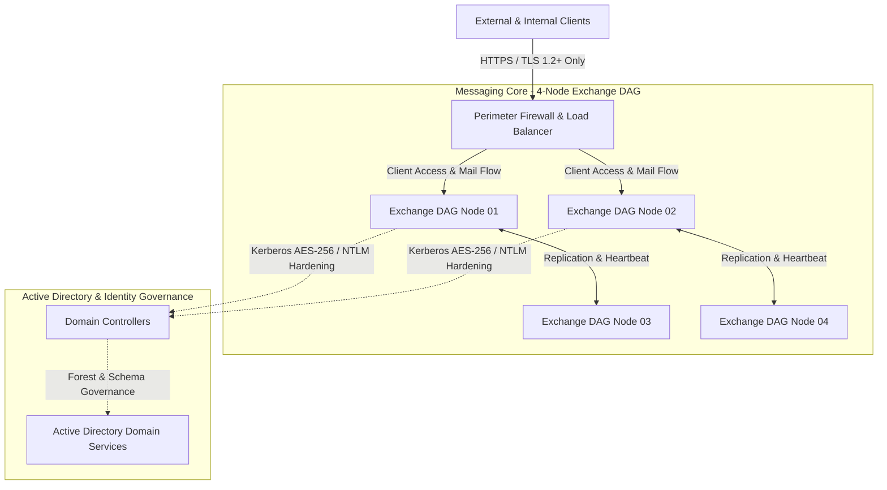

# Vulnerability Assessment, Protocol Hardening & Infrastructure Governance (Exchange DAG & Active Directory)

## Executive Summary
Design and execution of a comprehensive vulnerability assessment, protocol hardening, and security posture upgrade for an enterprise messaging infrastructure supported by a 4-node virtualized Microsoft Exchange Server Database Availability Group (DAG). The initiative identified and mitigated critical authentication exposure risks (clear-text legacy protocols), mapped remote code execution (RCE) and local elevation of privilege (LoPE) vulnerabilities, performed identity layer security analysis on Active Directory, and established capacity/connectivity governance to ensure continuous business operations and high availability.

---

## Technical Architecture & Assessment Domain

