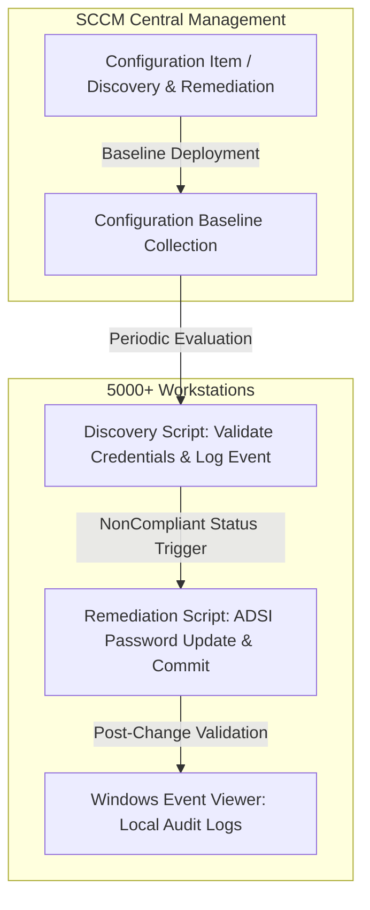

# Automated Local Administrator Password Lifecycle

## Overview
* **Core Domains:** Cybersecurity, IT Infrastructure, Identity and Access Management (IAM), Compliance Automation & Endpoint Hardening.
* **Project Focus:** Development and deployment of an automated lifecycle and periodic rotation mechanism for local administrator passwords across more than 5,000 corporate workstations, eliminating static credential risks and reused passwords.

---

## Architecture & Compliance Workflow

