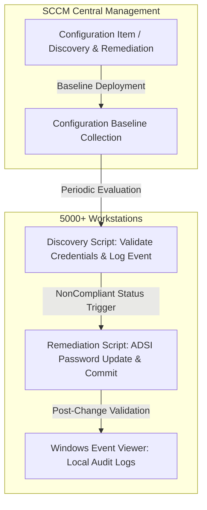

# Automated Local Administrator Password Lifecycle

## Overview
* **Core Domains:** Cybersecurity, IT Infrastructure, Identity and Access Management (IAM), Compliance Automation & Endpoint Hardening.
* **Project Focus:** Development and deployment of an automated lifecycle and periodic rotation mechanism for local administrator passwords across more than 5,000 corporate workstations, eliminating static credential risks and reused passwords.

---

## Architecture & Compliance Workflow

---

## Scenario & Technical Solution
* **The Challenge:** The corporate network consisted of over 5,000 workstations where the local administrator account represented a critical risk vector, allowing standardized or outdated credentials and facilitating lateral movement in case of a breach.
* **Discovery Script:** Developed in PowerShell and integrated into the SCCM Configuration Item (CI) to locally validate administrative credentials using the `System.DirectoryServices.AccountManagement` API, logging audit events to the Windows Event Viewer.
* **Remediation Script:** Triggered automatically upon non-compliance detection (`NonCompliant`), executing PowerShell/ADSI routines to silently and securely update the local administrator password, followed by post-change validation and success logging.
* **Configuration Baseline:** Configuration Items were grouped into a Baseline targeted at corporate workstation collections, enabling real-time centralized monitoring of `Compliant`, `Non-Compliant`, and error operational statuses.

---

## Repository Contents (Sanitized)
* `docs/`: Official technical documentation and standard operating procedures (SIT).
* `src/Invoke-LocalAdminDiscovery.ps1`: SCCM discovery script for credential validation and event logging.
* `src/Invoke-LocalAdminRemediation.ps1`: Automated ADSI remediation script for password updates.
* `src/Audit-LocalAdminEvents.ps1`: Local Event Viewer log parser and auditing tool.

---

*Disclaimer: All IP addresses, server names, credentials, domain identifiers, and proprietary names in this repository have been fully sanitized and anonymized.*
