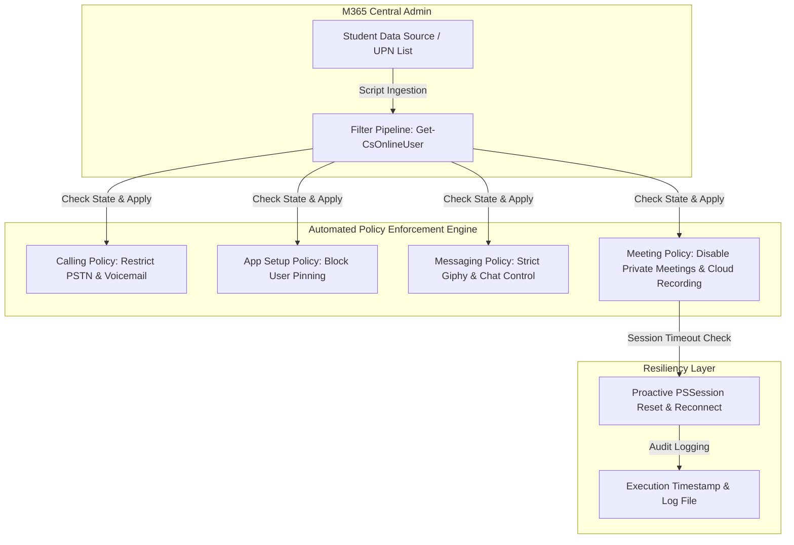

# Automated Microsoft Teams Governance & Policy Enforcement

## Overview
* **Core Domains:** Cybersecurity, M365 Governance, PowerShell Automation, Identity & Access Management (Teams Admin).
* **Project Focus:** Design and implementation of a scalable digital governance model and automated PowerShell batch assignment framework to enforce strict communication, meeting, and application security policies for thousands of students across educational institutions.

---

## Architecture & Compliance Workflow

## Scenario & Technical Solution
* **The Challenge:** Large-scale educational institutions managing vast student user bases in Microsoft 365 required strict control over platform collaboration features. Unrestricted functionality allowed unauthorized private meetings, PSTN/external calling, and unmonitored app pinning. Manual GUI-based assignment for thousands of accounts distributed across multiple units and grades was operationally unfeasible, while conventional batch scripts frequently failed due to remote PowerShell session timeouts.
* **Custom Security Policies (Hardening):** Created and parameterized specialized policies per school unit using the Microsoft Teams PowerShell module, establishing strict controls across Calling (`AllowPrivateCalling $false`, `AllowVoicemail AlwaysDisabled`), App Setup (`AllowUserPinning $false`), Messaging (`GiphyRatingType Strict`, `AllowRemoveUser $false`), and Meeting (`AllowChannelMeetingScheduling $false`, `AllowPrivateMeetingScheduling $false`, `AllowCloudRecording $false`).
* **Granular Bulk Automation:** Developed advanced PowerShell automation routines filtering accounts via `Get-CsOnlineUser` based on explicit UPN patterns and departmental structures (e.g., `108-EF-1*`, `108-EM-1*`), complete with real-time timestamp logging and performance tracking.
* **Session Resiliency Mechanics:** Embedded proactive PSSession management (`Get-PSSession | Remove-PSSession` followed by automatic connector re-initialization) directly into the execution flow to neutralize throttling and timeout constraints inherent in remote management modules.

---

## Repository Contents (Sanitized)

* `docs/` : Governance architecture blueprints and compliance mapping documentation.
* `src/New-TeamsMessagingPolicy.ps1` : Messaging baseline configuration template for student security and permissions.
* `src/New-TeamsMeetingPolicy.ps1` : Meeting baseline configuration template for restriction and collaboration settings.
* `src/New-TeamsCallingPolicy.ps1` : Calling baseline configuration template for restricted student communication.
* `src/New-TeamsAppSetupPolicy.ps1` : App setup baseline template for managing application pinning and access.
* `src/Set-StudentTeamsPolicies.ps1` : Automated bulk deployment script for granular policy assignment by department and class groups.

---

*Disclaimer: All tenant identifiers, organization domains, user principal names, and structural naming conventions in this repository have been fully sanitized and anonymized.*
