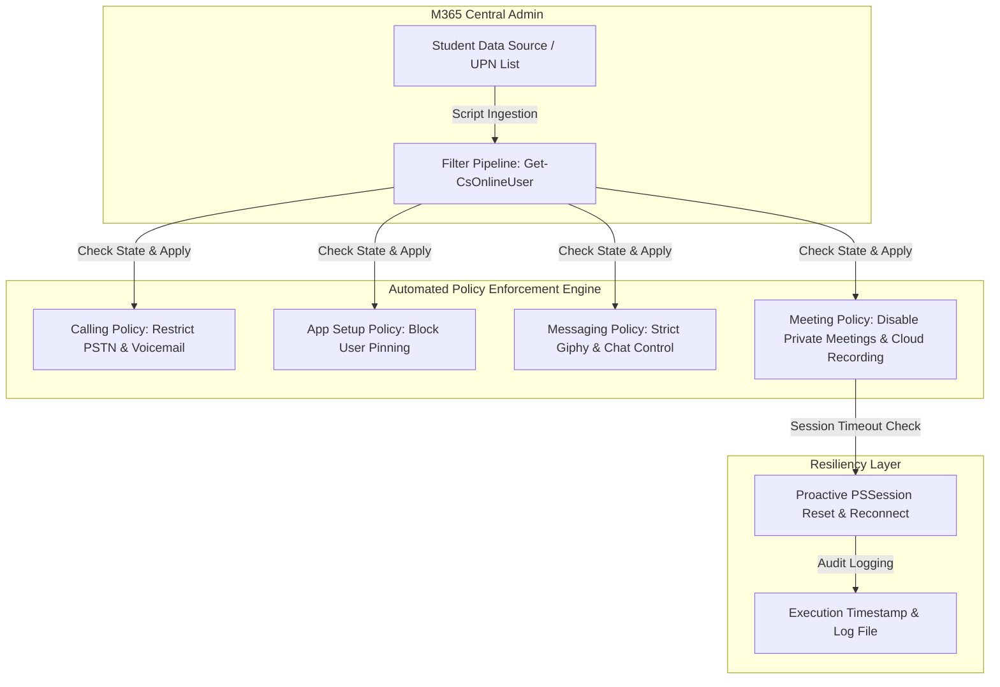

# Automated Microsoft Teams Governance & Policy Enforcement

## Overview
* **Core Domains:** Cybersecurity, M365 Governance, PowerShell Automation, Identity & Access Management (Teams Admin).
* **Project Focus:** Design and implementation of a scalable digital governance model and automated PowerShell batch assignment framework to enforce strict communication, meeting, and application security policies for thousands of students across educational institutions.

---

## Architecture & Compliance Workflow

