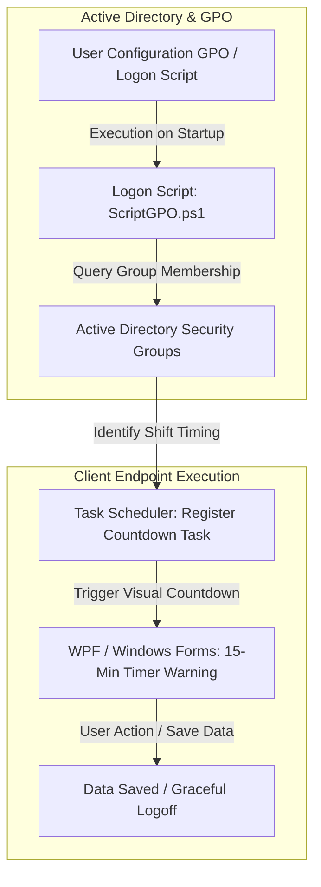

# Active Directory Session Governance & UserLock Automation

## Executive Summary
Implementation of an automated session management and user experience workaround framework using Active Directory Group Policy Objects (GPOs), native Task Scheduler, and PowerShell. The solution mitigates the rigid limitations of third-party access control tools (UserLock), preventing data loss from abrupt session lockouts and eliminating unnecessary service desk tickets.

---

## Architecture & Workaround Workflow

