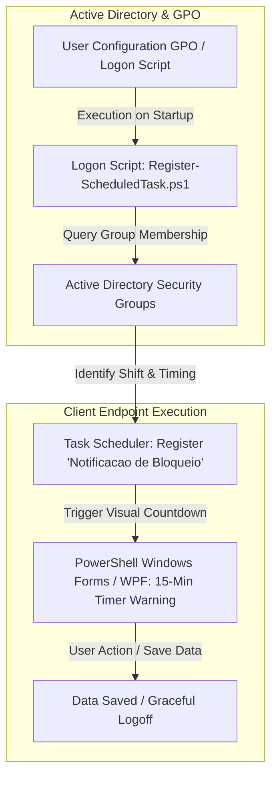

# Active Directory Session Governance & UserLock Automation

## Executive Summary
Implementation of an automated session management and user experience workaround framework using Active Directory Group Policy Objects (GPOs), native Task Scheduler, and PowerShell. The solution mitigates the rigid limitations of third-party access control tools (UserLock), which enforce abrupt session lockouts without prior notice. By deploying a dynamic logon script and an interactive WPF notification module, this framework prevents unsaved data loss and eliminates unnecessary service desk tickets.

---

## Architecture & Workaround Workflow

## Technical Implementation Steps

### 1. User Logon GPO Configuration
* **Target Path:** `User Configuration > Policies > Windows Settings > Scripts (Logon/Logoff)`[cite: 7].
* **Configuration:** Assigned the `Register-ScheduledTask.ps1` script to execute upon user logon within the targeted Organizational Unit (OU)[cite: 7].

### 2. PowerShell Execution Policy Hardening
* **Target Path:** `Computer Configuration > Policies > Administrative Templates > Windows Components > Windows PowerShell > Turn on Script Execution`[cite: 7].
* **Configuration:** Set policy to `Enabled` with execution policy configured to **"Allow local scripts and remote signed scripts"** to securely permit domain-wide script execution[cite: 7].

### 3. Dynamic Shift Grouping & Task Scheduling Logic
The logon script evaluates the user's Active Directory group membership (`$Group1` or `$Group2`) and dynamically registers a native Windows Scheduled Task with customized warning thresholds[cite: 7, 8]:
* **Shift Group 1 (`$Group1`):** Configured for session lockouts at 12:00 PM, triggering the visual warning at 11:44:58 AM (`$TaskTimeGrupo1`)[cite: 8].
* **Shift Group 2 (`$Group2`):** Configured for session lockouts at 1:00 PM, triggering the visual warning at 12:44:58 PM (`$TaskTimeGrupo2`)[cite: 8].
* **Execution Artifacts:** Automatically provisions helper scripts under `C:\Temp\Mensagem.ps1` and writes execution audit logs to `%TEMP%\registro_tarefa.log`[cite: 7].

---

## Interactive User Experience (UX)

The user interface features a lightweight, corporate-styled Windows Forms / WPF dialog window (`MainForm`) displaying a real-time 900-second (15-minute) countdown timer (`$TimeLeft_Seconds`)[cite: 7, 8].

* **Visual Design:** Features a professional top banner (`#0072C6` branding color) with clear typography and a prominent red countdown ticker (`labelTime`) to alert workers before forced termination[cite: 8].

---

## Repository Contents (Sanitized)

* `docs/`: Deployment guides and administrative templates.
* `src/Register-ScheduledTask.ps1`: Core user logon automation script for group validation and scheduled task registration[cite: 7, 8].
* `src/Invoke-SessionCountdownWarning.ps1`: Interactive WPF graphical countdown notification module[cite: 7, 8].

---

*Disclaimer: All IP addresses, server names, credentials, domain identifiers, and proprietary names in this repository have been fully sanitized and anonymized.*
