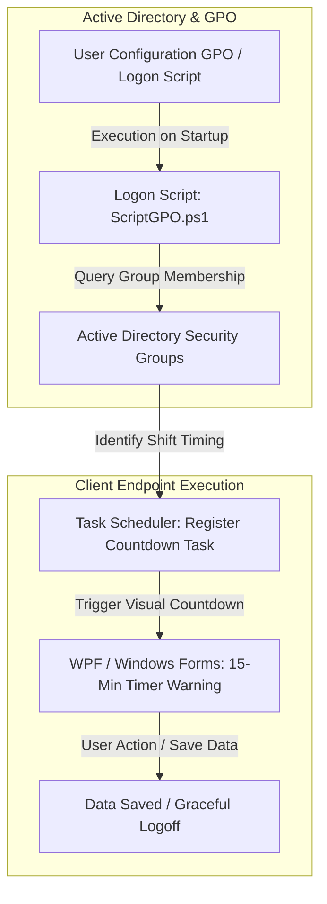

# Active Directory Session Governance & UserLock Automation

## Executive Summary
Implementation of an automated session management and user experience workaround framework using Active Directory Group Policy Objects (GPOs), native Task Scheduler, and PowerShell. The solution mitigates the rigid limitations of third-party access control tools (UserLock), preventing data loss from abrupt session lockouts and eliminating unnecessary service desk tickets.

---

## Architecture & Workaround Workflow

## Key Engineering Decisions & Hardening

* **Software Limitation Workaround:** Addressed the rigid behavior of enterprise access controls that enforce abrupt logoffs without prior warning, reducing user friction and preventing unsaved data loss.
* **Dynamic Shift Grouping:** Integrated Active Directory security group evaluation inside logon scripts to dynamically handle multi-shift schedules (`$Grupo1`, `$Grupo2`) and calculate precise warning thresholds.
* **Native Task Automation:** Programmed automated creation of native Windows Scheduled Tasks within the user context to trigger interactive visual countdown modules.
* **Interactive User Experience (UX):** Deployed a lightweight PowerShell Windows Forms / WPF graphical interface featuring a 900-second (15-minute) countdown timer, ensuring clear visibility for workers to preserve ongoing tasks.
* **GPO Centralized Enforcement:** Distributed configuration settings securely through `User Configuration > Windows Settings > Scripts (Logon)` with enforced `RemoteSigned` execution policies and local logging for comprehensive auditability (`%TEMP%\registro_tarefa.log`).

---

## Repository Contents (Sanitized)

* `docs/`: Deployment guides and administrative templates (`UserLock.adm`).
* `src/ScriptGPO.ps1`: Core user logon automation script for group validation and scheduled task registration.
* `src/AvisoEncerramentoSessao.ps1`: Interactive WPF graphical countdown notification module.

---

*Disclaimer: All IP addresses, server names, credentials, domain identifiers, and proprietary names in this repository have been fully sanitized and anonymized.*
