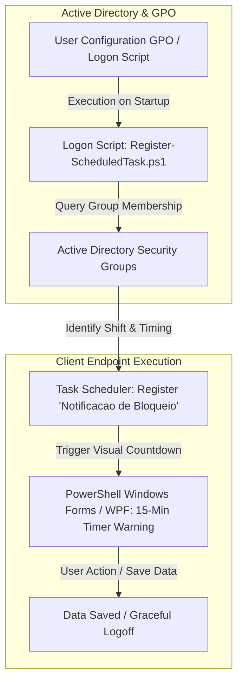

# Active Directory Session Governance & UserLock Automation

## Executive Summary
Implementation of an automated session management and user experience workaround framework using Active Directory Group Policy Objects (GPOs), native Task Scheduler, and PowerShell. The solution mitigates the rigid limitations of third-party access control tools (UserLock), which enforce abrupt session lockouts without prior notice. By deploying a dynamic logon script and an interactive WPF notification module, this framework prevents unsaved data loss and eliminates unnecessary service desk tickets.

---

## Architecture & Workaround Workflow

