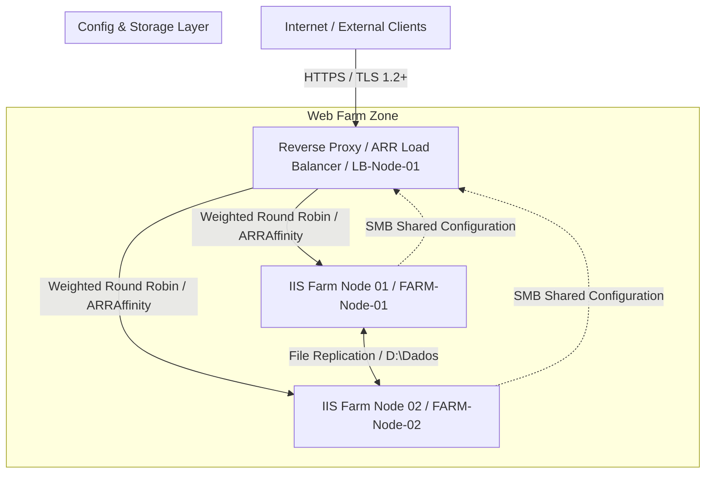

# 06-Enterprise WebFarm Security & High Availability

## Executive Summary
Design and implementation of a high-availability, secure enterprise web farm infrastructure using Microsoft Internet Information Services (IIS) and Application Request Routing (ARR)[cite: 6]. The architecture provides perimeter security, load balancing, centralized configuration management, and continuous file synchronization to guarantee high performance and data integrity[cite: 6].

---

## Technical Architecture

## Server Specifications & Inventory

* **Load Balancer & Edge Proxy (`LB-Node-01`):** Reverse proxy, SSL termination, and ARR load balancer[cite: 6] with 4 vCPUs, 8 GB RAM, and local disks for OS and configuration repository.
* **Web Farm Node 01 (`FARM-Node-01`):** Primary backend application server[cite: 6] with 16 vCPUs, 8 GB RAM, and dedicated storage for application data and replication.
* **Web Farm Node 02 (`FARM-Node-02`):** Secondary backend application server[cite: 6] mirroring `FARM-Node-01` to provide redundancy and continuous high availability.

---

## Repository Contents (Sanitized)
* `docs/`: Architecture diagrams and technical specification files.
* `src/setup-arr-farm.ps1`: Automated PowerShell deployment script for configuring the ARR server farm.
* `src/configure-replication.ps1`: Synchronization and file replication setup scripts.
* `src/enable-shared-config.ps1`: Automation scripts for setting up centralized IIS shared configuration.

---

*Disclaimer: All IP addresses, server names, credentials, and domain identifiers in this repository have been fully sanitized and anonymized[cite: 6].*
