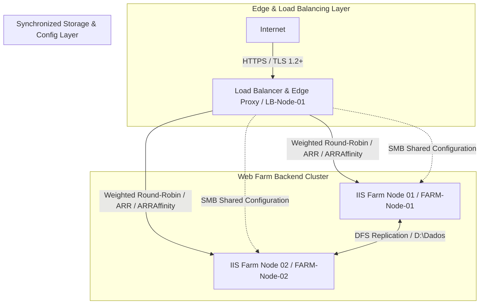

# 06-Enterprise WebFarm Security & High Availability

## Project Overview

This repository contains the technical documentation, architecture specifications, and implementation guidelines for a high-availability, secure enterprise web farm deployment. Based on a production-grade infrastructure model, this case study demonstrates best practices in edge security, TLS traffic encryption, centralized configuration management, and load balancing using Microsoft Internet Information Services (IIS) and Application Request Routing (ARR).

---

## Architecture Topology

The infrastructure is built on a 3-tier high-availability architecture utilizing Windows Server and IIS, deployed across virtualized environments.

## Server Specifications & Inventory

### 1. Load Balancer & Edge Proxy Node
* **Hostname:** `LB-Node-01`
* **Role:** Reverse Proxy, SSL Termination Gateway, and Application Request Routing (ARR) Load Balancer
* **IP Address:** `[LoadBalancer-IP]`
* **Operating System:** Microsoft Windows Server (64-bit)
* **Hardware Specs:** 4 vCPUs, 8 GB RAM, Paravirtual SCSI, VMXNET3 Ethernet
* **Storage:** Local Disk C: (40 GB, OS), Local Disk D: (20 GB, Shared Config Repository)

### 2. Web Farm Node 01
* **Hostname:** `FARM-Node-01`
* **Role:** Backend Application Server / Primary Replication Member
* **IP Address:** `[Node01-IP]`
* **Operating System:** Microsoft Windows Server (64-bit)
* **Hardware Specs:** 16 vCPUs, 8 GB RAM, Paravirtual SCSI, VMXNET3 Ethernet
* **Storage:** Local Disk C: (40 GB, OS), Local Disk D: (60 GB, Application Data & Storage Replica)

### 3. Web Farm Node 02
* **Hostname:** `FARM-Node-02`
* **Role:** Backend Application Server / Secondary Replication Member
* **IP Address:** `[Node02-IP]`
* **Operating System:** Microsoft Windows Server (64-bit)
* **Hardware Specs:** 16 vCPUs, 8 GB RAM, Paravirtual SCSI, VMXNET3 Ethernet
* **Storage:** Local Disk C: (40 GB, OS), Local Disk D: (60 GB, Application Data & Storage Replica)
