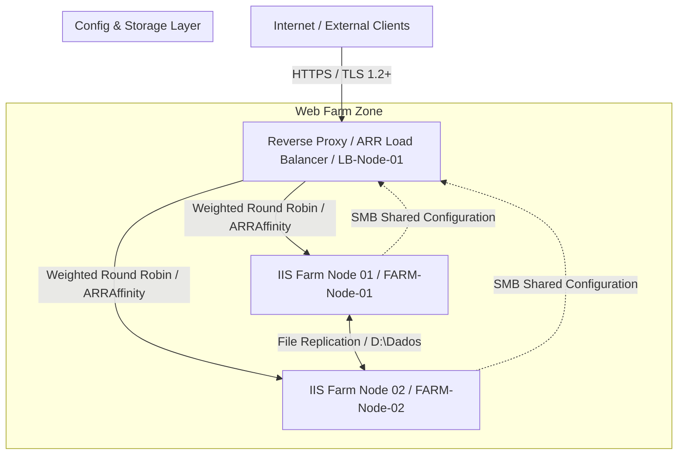

# 06-Enterprise WebFarm Security & High Availability

## Executive Summary
Design and implementation of a high-availability, secure enterprise web farm infrastructure using Microsoft Internet Information Services (IIS) and Application Request Routing (ARR)[cite: 6]. The architecture provides perimeter security, load balancing, centralized configuration management, and continuous file synchronization to guarantee high performance and data integrity[cite: 6].

---

## Technical Architecture

