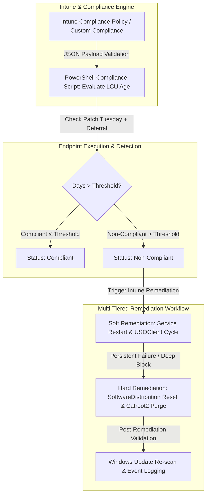

# 07-Intune Patch Compliance & Automated Remediation

## Executive Summary
Design and implementation of an automated, multi-tiered patch management governance and compliance enforcement framework for Windows endpoints within a hybrid Microsoft 365 and Microsoft Intune ecosystem[cite: 7, 8, 9, 10, 11, 12]. The project establishes programmatic detection logic based on Microsoft's Patch Tuesday cycle, dynamic quality update deferrals, proactive compliance evaluation scripts, and multi-level automated remediation routines to eliminate compliance gaps and ensure zero-touch endpoint security[cite: 7, 8, 9, 10, 11, 12].

---

## Technical Architecture

## Key Engineering Decisions & Hardening

* **Dynamic Patch Tuesday Calculation:** Engineered custom PowerShell logic (`Get-SecondTuesday`) to programmatically determine the exact baseline release date of cumulative updates based on Microsoft's monthly patch schedule, accounting for custom device quality update deferrals (`Get-QualityDeferral`)[cite: 7, 8, 11].
* **Multi-Tiered Compliance Thresholds:** Implemented strict evaluation scripts that measure the exact delta days between the effective target date and current system time, categorizing endpoints into tailored compliance tiers (e.g., 30, 50, or 60-day thresholds)[cite: 7, 8, 11].
* **Soft Remediation Framework:** Developed automated recovery scripts (`Remediacao_WindowsUpdate.log`) designed to safely restart core update subsystems (`wuauserv`, `bits`, `cryptsvc`), clear stale BITS transfer jobs, and trigger native Update Session Orchestrator (`usoclient.exe`) execution cycles for seamless background updates[cite: 10].
* **Hard Remediation & Cache Purging:** Built robust escalation remediation routines (`Remediacao_WindowsUpdate_Hard.log`) capable of handling deeply corrupted update stores by safely terminating update services, renaming and archiving legacy `SoftwareDistribution` and `catroot2` directories with timestamped backups, and enforcing full re-registration of system update components[cite: 9].
* **Intune Custom Compliance Integration:** Seamlessly bridged local PowerShell detection scripts with Microsoft Intune JSON compliance payloads and localized user notification strings, guaranteeing clear remediation instructions and real-time security posture visibility across the entire corporate fleet[cite: 11, 12].

---

## Server & Endpoint Specifications & Inventory

* **Intune Cloud Management Tenant:** Centralized policy authoring, compliance tracking, and automated remediation deployment engine.
* **Corporate Windows Endpoints (Windows 10 / 11):** Managed devices subject to automated compliance evaluation, custom configuration policies, and scheduled telemetry logging under `C:\Windows\Temp\Scripts_and_remediations`[cite: 9, 10].

---

## Repository Contents (Sanitized)
* `docs/`: Architecture blueprints, compliance workflows, and technical specifications.
* `src/Detect-WindowsUpdateCompliance-30Days.ps1`: Compliance detection script utilizing 30-day strict threshold logic[cite: 8].
* `src/Detect-WindowsUpdateCompliance-50Days.ps1`: Compliance detection script utilizing 50-day threshold logic[cite: 7].
* `src/Detect-WindowsUpdateCompliance-IntuneJSON.ps1`: Advanced compliance evaluation script outputting JSON structures for Intune Custom Compliance[cite: 11].
* `src/Invoke-WindowsUpdateSoftRemediation.ps1`: Soft remediation script for service resets and USOClient orchestration[cite: 10].
* `src/Invoke-WindowsUpdateHardRemediation.ps1`: Hard remediation script for cache purging (`SoftwareDistribution`/`catroot2`) and deep repair[cite: 9].
* `configs/Intune-Compliance-Policy.json`: Intune custom compliance policy definition and localization string templates[cite: 12].

---

*Disclaimer: All tenant identifiers, organization domains, user principal names, and structural naming conventions in this repository have been fully sanitized and anonymized.*
