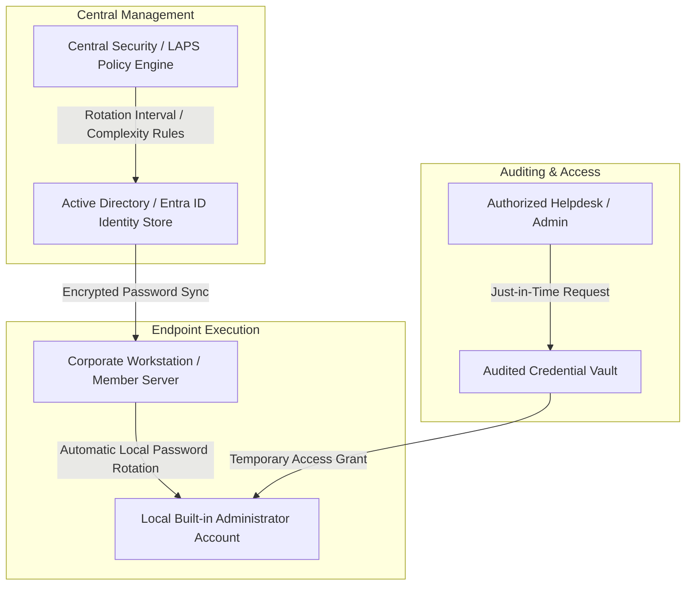

# Automated Local Administrator Password Lifecycle & Credential Protection

## Executive Summary
Implementation of an automated local administrator password management and rotation lifecycle across enterprise endpoints. The solution eliminates static, shared administrative credentials, prevents lateral movement vectors via pass-the-hash attacks, and enforces secure, time-bound access auditing.

---

## Architecture & Credential Rotation Workflow

---

## Key Engineering Decisions & Hardening

* **Elimination of Static Master Passwords:** Replaced standard factory-imaged or static local administrator passwords with dynamically generated, cryptographically secure unique passwords per machine.
* **Automated Rotation Lifecycle:** Configured scheduled password expiration and automatic rotation policies directly integrated with directory services, invalidating credentials immediately after use.
* **Granular Access Auditing:** Enforced strict logging policies to capture every instance of local administrator account usage, tracking who accessed credentials and when.
* **Lateral Movement Mitigation:** Severely reduced exposure to pass-the-hash and credential-theft attacks by ensuring compromise of a single endpoint workstation does not expose administrative keys across the broader domain network.
* **Emergency Recovery Provisioning:** Established secure offline recovery procedures and encrypted escrow mechanics for stranded or isolated machines without direct network line-of-sight.

---

## Repository Contents (Sanitized)
* `docs/`: Password lifecycle architecture diagrams and threat modeling notes.
* `src/Invoke-LocalAdminRotation.ps1`: Automated PowerShell script for local administrator credential regeneration and sync.
* `src/Audit-LocalAdminUsage.ps1`: Event log auditing script tracking local admin logon events and security anomalies.
* `src/Configure-LAPSClientPolicy.ps1`: Hardening configuration script enforcing local password expiration thresholds and complexity.

---

*Disclaimer: All IP addresses, server names, credentials, and domain identifiers in this repository have been fully sanitized and anonymized.*
