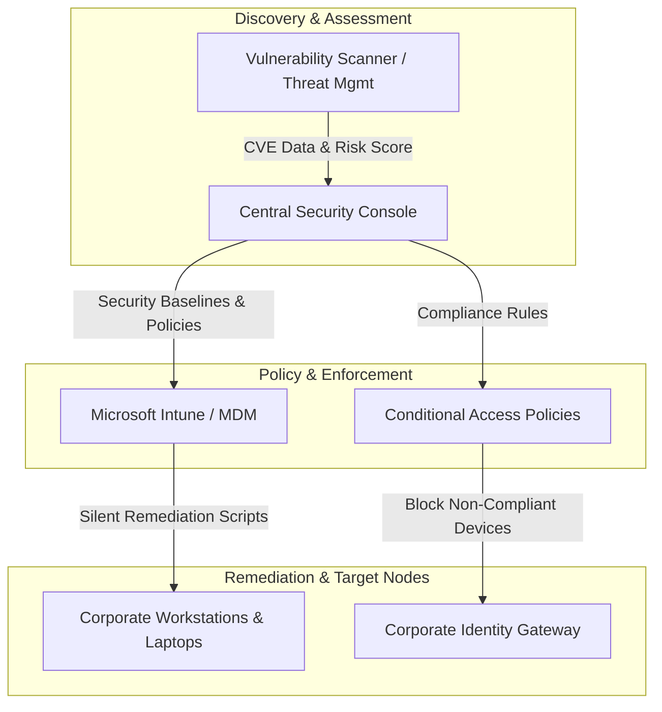

# Enterprise Endpoint Management, Vulnerability Remediation & Security Compliance

## Executive Summary
Implementation of an enterprise-grade endpoint security baseline, continuous vulnerability management program, and automated compliance policy framework across hybrid corporate workstations and mobile devices. The solution significantly reduced the infrastructure exposure window and automated patch distribution for high-severity CVEs.

---

## Architecture & Remediation Workflow

---

## Key Engineering Decisions & Hardening

* **Automated Patch & Vulnerability Remediation:** Configured automated deployment rings for third-party application patching and OS updates, targeting zero-day and critical CVE vulnerabilities within a 48-hour SLA.
* **Unified Endpoint Management (MDM):** Enforced Microsoft Intune compliance policies, restricting access to internal corporate data for non-compliant or unmanaged endpoints via Conditional Access rules.
* **BitLocker & Drive Encryption Standards:** Automated BitLocker deployment with XTS-AES 256-bit encryption across all mobile endpoints, centralizing recovery key storage in Entra ID with audited access logging.
* **Attack Surface Reduction (ASR):** Implemented Attack Surface Reduction rules via GPO/MDM to block executable content from email client and webmail, preventing unauthorized child processes from running on end-user devices.
* **Automated Audit & Compliance Scripting:** Developed PowerShell automation routines for continuous baseline auditing, local account rotation, and real-time posture reporting.

---

## Repository Contents (Sanitized)
* `docs/`: Endpoint compliance architecture and patch workflow diagrams.
* `src/Invoke-VulnerabilityRemediation.ps1`: Automated PowerShell script for local endpoint compliance and CVE mitigation.
* `src/Enable-BitLockerCompliance.ps1`: Script for enforcing BitLocker XTS-AES 256 encryption and key escrow.
* `src/Audit-ASRRulesStatus.ps1`: Audit tool for validating active Attack Surface Reduction rules on target endpoints.

---

*Disclaimer: All IP addresses, server names, credentials, and domain identifiers in this repository have been fully sanitized and anonymized.*
